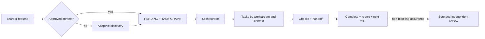

# Agent Harness Kit

> A platform-neutral, artifact-driven development harness with native Codex and Claude Code entrypoints, optional project learning, and a separate harness-engineering study pack.

**Current source version: `0.4.1`.** This is an executable operating scaffold: capable agents follow its contracts and validators. It is not a daemon that independently launches agents or locks files at the operating-system level.

> 🌐 **Language:** English
>
> **[Português (Brasil)](README.pt-BR.md)** — switch language

[Quick start](#quick-start) · [Contained installation](docs/EMBEDDED-INSTALLATION.md) · [How it works](#how-it-works) · [Architecture](docs/ARCHITECTURE.md) · [Status/completion](docs/STATUS-AND-COMPLETION.md) · [Packaging](docs/DISTRIBUTION.md) · [Open decisions](OPEN-DECISIONS.md)

## Greenfield or an existing harness

Agent Harness Kit supports both new projects and repositories that already contain instructions, agents, rules, knowledge, or another harness.

- **Greenfield:** discovery creates the first approved project context and task graph.
- **Existing repository:** the kit preserves current authorities, installs through namespaced coexistence, and allows cutover only after human semantic-equivalence review.

It does not silently overwrite `AGENTS.md`, `CLAUDE.md`, `.agents/`, `.claude/`, or existing configuration. See the [adoption playbook](harness/playbooks/mature-harness-adoption.md).

## Project explanation audio

Listen to an English overview of the purpose and workflow of Agent Harness Kit.

https://github.com/user-attachments/assets/8d0d1956-5199-43d2-9cf7-3a4b625553bd

[Download the English MP3](media/agent-harness-kit-overview-en.mp3) · [Read the English narration script](media/overview-script-en.txt)

## What the harness provides

| Area | Behavior |
| --- | --- |
| Durable state | Approved context, decisions, human/macro `PENDING.md`, and technical `TASK-GRAPH.md` |
| Execution | Dependencies, exclusive file ownership, handoffs, checks, and automatic next-task progress |
| Contexts | Frontend, backend, data, infrastructure, and integration separated by task/agent when the host supports it |
| Status | Stage, progress, pending work by area, blockers, next action, and inspectable paths |
| Frontend | Default visual direction, mockup, image generation, and image-to-code workflow |
| Learning | Consented study mode with notes in Markdown, a local path, Obsidian, Notion, or another destination |
| Resource control | Two implementation attempts, two no-progress cycles, and three context expansions per goal lineage |
| Assurance | Independent reviewer, two reviews maximum, and no bureaucratic wait after passing checks |

Missing capabilities degrade explicitly. The harness never assumes MCP, network, secrets, authentication, worktrees, thread creation, or permissions.

## Profiles

| Profile | Includes | Best for |
| --- | --- | --- |
| `core` | Delivery, graph, status, review, and validation | Development without guided learning |
| `core-learning` | `core` plus project learning | Guided practice and debriefs during delivery |
| `full` | `core-learning` plus `learning-pack/` | Delivery and separate harness-engineering study |

Installing `core-learning` or `full` does not activate observation or publication. Study mode starts only after an explicit request and consent.

## Prerequisites

- Python 3 and a project directory.
- Codex or Claude Code for native activation; other platforms can follow the neutral playbooks.
- Git, multiple agents, sandboxes, MCP, and network access are optional.

## Quick start

```text
python tools/install.py --profile core --host <project-directory> --dry-run
python tools/install.py --profile core --host <project-directory>
```

1. The installer creates `agent-harness-kit/` and root `AGENTS.md` and `CLAUDE.md` entrypoints. If either file already exists, it preserves the project's content and adds or refreshes one clearly marked managed bridge block at the top so the first-response gate is read before legacy instructions.
2. Open a new agent context after installation so the host reloads the root entrypoint. On its first request, the agent reads the nested harness immediately and checks `harness-state/PROJECT-CONTEXT.md`. Without approved context, its first response is restricted to the kit welcome, a short discovery explanation, and exactly one [first-run discovery](harness/playbooks/first-run.md) question. It cannot recommend a solution, brand, stack, or plan first, and prior-chat/model memory is not approved project context.
3. After approval it creates `PENDING.md`, the graph, and tasks with workstream, agent, lease, context, criteria, and checks.
4. Tasks that pass checks are completed and reported without waiting for human approval; the next ready task may begin.
5. Validate the installation with `python tools/validate.py`.

## How it works



### Resume and pending work

On the first request in a new context window, a resume request, or a status request, the agent reads:

1. `harness-state/PROJECT-CONTEXT.md`;
2. `harness-state/PENDING.md`;
3. `harness-state/TASK-GRAPH.md`.

`PENDING.md` owns human decisions/actions and the macro completion view. `TASK-GRAPH.md` owns technical order, dependencies, leases, and execution. Every progress/step update—not only an explicit status request—shows current stage, progress, what continues without user action, human and macro pending items, active/ready/blocked graph nodes, blockers, next action, and inspectable paths. For “what do you need from me?”, human items come first.

Technical movement is persisted in a new `TASK-GRAPH.md` revision before it is reported. `PENDING.md` is updated only when human action or the macro project outcome changes; it is never the sole record of task progress.

### Contexts, frontend, and learning

- **Contexts:** a fresh context per task is the default. Visible threads, subagents, and parallelism are used only when the host exposes and authorizes them; otherwise the harness uses a manual or serialized artifact-handoff fallback.
- **Frontend:** screen requests use `frontend-screen` for orchestration. With approved screenshots, `image-to-code` is the primary coding skill, `frontend-screen` checks desktop/mobile fidelity, and `imagegen` creates only temporary photographs/raster assets. Design-direction skills remain available when no approved screen exists.
- **Learning:** requests such as “enable study mode” begin setup for goals, observation boundaries, and the exact note destination. No note is created and no `docs/` or remote fallback is assumed before the user confirms a path or a connector/MCP plus target. Credentials are never stored in the profile.

## Repository map

```text
AGENTS.md / CLAUDE.md   native entrypoints
harness/                roles, templates, and playbooks
docs/                   architecture, contracts, and policy
adapters/               Codex, Claude, and generic mappings
.agents/ / .claude/     on-demand skills and agents
validation/             valid fixtures and hostile mutations
tools/                  installation, validation, and packaging
learning-pack/          separate harness-engineering study
```

## Principles

1. Files—not chat memory—carry durable state.
2. Human/macro `PENDING.md` and technical `TASK-GRAPH.md` are separate authorities.
3. Tasks have exclusive ownership, progressive context, and reproducible verification.
4. Implementer and reviewer are independent; there is no automatic third review.
5. Passing work reports completion and continues without bureaucratic approval.
6. Models and tools do not expand authority; capability and degradation remain explicit.

## Current limitations

- No separate autonomous runtime opens sessions, integrates branches, deploys, or publishes notes by itself.
- File leases are validated graph contracts, not operating-system locks.
- Automatic thread creation, subagents, and isolation depend on actual host capabilities.
- Token metering, time limits, and forced termination are not yet portable across hosts.

See the [readiness audit](docs/PUBLICATION-READINESS.md), [open decisions](OPEN-DECISIONS.md), and [MIT License](LICENSE).
