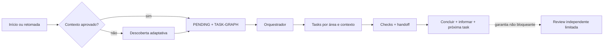

# Agent Harness Kit

> Um harness de desenvolvimento agnóstico de plataforma e orientado a artefatos, com entradas nativas para Codex e Claude Code, aprendizado opcional e um pacote separado para estudar engenharia de harness.

**Versão atual do código-fonte: `0.4.1`.** O projeto é um scaffold operacional executável: agentes capazes seguem seus contratos e validadores. Ele não é um daemon que inicia agentes sozinho ou bloqueia arquivos no sistema operacional.

> 🌐 **Idioma:** Português (Brasil)
>
> **[Ler em English →](README.md)**

[Início rápido](#início-rápido) · [Instalação contida](docs/EMBEDDED-INSTALLATION.md) · [Como funciona](#como-funciona) · [Arquitetura](docs/ARCHITECTURE.md) · [Status e conclusão](docs/STATUS-AND-COMPLETION.md) · [Distribuição](docs/DISTRIBUTION.md) · [Decisões em aberto](OPEN-DECISIONS.md)

## Projeto greenfield ou harness existente

O Agent Harness Kit funciona tanto em projetos novos quanto em repositórios que já possuem instruções, agentes, regras, conhecimento ou outro harness.

- **Greenfield:** a descoberta cria o primeiro contexto aprovado e o grafo de tarefas.
- **Repositório existente:** o kit preserva as autoridades atuais, instala por coexistência com namespace e só permite cutover depois de revisão humana de equivalência.

Ele não sobrescreve silenciosamente `AGENTS.md`, `CLAUDE.md`, `.agents/`, `.claude/` ou configurações existentes. Veja o [playbook de adoção](harness/playbooks/mature-harness-adoption.md).

## Áudio de explicação do projeto

Ouça uma visão geral em português sobre o propósito e o fluxo do Agent Harness Kit.

https://github.com/user-attachments/assets/4c68f8a0-bfac-4847-b2ea-9adeae24c17c

[Baixar o MP3 em português](media/agent-harness-kit-overview-pt-BR.mp3) · [Ler o roteiro em português](media/overview-script-pt-BR.txt)

## O que o harness entrega

| Área | Comportamento |
| --- | --- |
| Estado durável | Contexto aprovado, decisões, `PENDING.md` humano/macro e `TASK-GRAPH.md` técnico |
| Execução | Dependências, propriedade exclusiva de arquivos, handoffs, checks e avanço automático |
| Contextos | Frontend, backend, dados, infra e integração separados por task/agente quando o host permite |
| Status | Etapa, progresso, pendências por área, bloqueios, próxima ação e caminhos inspecionáveis |
| Frontend | Fluxo padrão de direção visual, mockups, geração de imagens e tradução para código |
| Aprendizado | Modo estudo consentido com notas em Markdown, pasta local, Obsidian, Notion ou outro destino |
| Controle | Duas tentativas de implementação, dois ciclos sem progresso e três expansões de contexto por linhagem |
| Garantia | Revisor independente, no máximo duas reviews e nenhuma espera burocrática após checks aprovados |

Capacidades ausentes degradam de forma explícita. O harness nunca presume MCP, rede, segredos, autenticação, worktrees, criação de chats ou permissões.

## Perfis

| Perfil | Inclui | Indicado para |
| --- | --- | --- |
| `core` | Entrega, grafo, status, revisão e validação | Desenvolvimento sem aprendizado acompanhado |
| `core-learning` | `core` + aprendizado do projeto | Prática guiada e debriefings durante o trabalho |
| `full` | `core-learning` + `learning-pack/` | Entrega e estudo separado de engenharia de harness |

Instalar `core-learning` ou `full` não ativa observação nem publicação. O modo estudo só começa após pedido e consentimento explícitos.

## Pré-requisitos

- Python 3 e um diretório de projeto.
- Codex ou Claude Code para ativação nativa; outras plataformas podem seguir os playbooks neutros.
- Git, múltiplos agentes, sandboxes, MCP e rede são opcionais.

## Início rápido

```text
python tools/install.py --profile core --host <diretório-do-projeto> --dry-run
python tools/install.py --profile core --host <diretório-do-projeto>
```

1. O instalador cria `agent-harness-kit/` e os pontos de entrada `AGENTS.md` e `CLAUDE.md` na raiz. Se algum deles já existir, preserva o conteúdo do projeto e adiciona ou reposiciona um único bloco gerenciado no topo, para que o gate da primeira resposta seja lido antes das instruções legadas.
2. Abra um novo contexto do agente depois da instalação para que ele recarregue o ponto de entrada da raiz. Na primeira solicitação, o agente lê imediatamente o harness interno e verifica `harness-state/PROJECT-CONTEXT.md`. Sem contexto aprovado, a primeira resposta fica restrita à apresentação do kit, uma explicação curta da descoberta e exatamente uma pergunta da [descoberta inicial](harness/playbooks/first-run.md). Ele não pode recomendar solução, marca, stack ou plano antes disso, e memória do modelo ou de outro chat não é contexto aprovado do projeto.
3. Depois da aprovação, cria `PENDING.md`, o grafo e as tasks com área, agente, lease, contexto, critérios e checks.
4. Tasks aprovadas nos checks são concluídas e informadas sem esperar aprovação humana; a próxima task pronta pode começar.
5. Valide a instalação com `python tools/validate.py`.

## Como funciona



### Retomada e pendências

Na primeira chamada de uma nova janela, em pedidos de retomada ou de status, o agente lê nesta ordem:

1. `harness-state/PROJECT-CONTEXT.md`;
2. `harness-state/PENDING.md`;
3. `harness-state/TASK-GRAPH.md`.

`PENDING.md` guarda decisões, ações humanas e a visão macro do que falta. `TASK-GRAPH.md` guarda ordem, dependências, leases e execução técnica. Toda atualização de progresso/etapa — não apenas um pedido explícito de status — mostra etapa atual, progresso, o que continua sem ação do usuário, pendências humanas e macro, nós ativos/prontos/bloqueados do grafo, bloqueios, próxima ação e caminhos inspecionáveis. Ao perguntar “quais são minhas pendências?”, os itens humanos vêm primeiro.

Todo movimento técnico é persistido em uma nova revisão de `TASK-GRAPH.md` antes de ser informado. `PENDING.md` só é atualizado quando muda uma ação humana ou o resultado macro do projeto; nunca pode ser o único registro do progresso de uma task.

### Contextos, frontend e estudo

- **Contextos:** um contexto novo por task é o padrão. Chats visíveis, subagentes e paralelismo só são usados quando o host oferece e autoriza essas capacidades; caso contrário, há fallback manual ou sequencial com handoff.
- **Frontend:** pedidos de tela usam `frontend-screen` para orquestração. Com screenshots aprovados, `image-to-code` é a skill principal de código, `frontend-screen` confere fidelidade entre desktop e mobile, e `imagegen` cria apenas fotografias/recursos raster temporários. Skills de direção visual continuam disponíveis quando ainda não existe tela aprovada.
- **Estudo:** pedidos como “ativa modo estudo” iniciam a configuração de objetivos, limites de observação e destino exato das notas. Nenhuma nota é criada e nenhum fallback em `docs/` ou serviço remoto é presumido antes de o usuário confirmar um caminho ou um conector/MCP e alvo. Credenciais nunca são gravadas no perfil.

## Mapa do repositório

```text
AGENTS.md / CLAUDE.md   entradas nativas
harness/                papéis, templates e playbooks
docs/                   arquitetura, contratos e políticas
adapters/               mapeamentos Codex, Claude e genérico
.agents/ / .claude/     skills e agentes carregados sob demanda
validation/             fixtures válidas e mutações hostis
tools/                  instalação, validação e empacotamento
learning-pack/          estudo separado de engenharia de harness
```

## Princípios

1. Arquivos, não memória de chat, carregam o estado durável.
2. `PENDING.md` humano/macro e `TASK-GRAPH.md` técnico são autoridades diferentes.
3. Tasks têm ownership exclusivo, contexto progressivo e verificação reproduzível.
4. Implementador e revisor são independentes; não existe terceira review automática.
5. Conclusão aprovada nos checks informa o resultado e segue sem aprovação burocrática.
6. Modelos e ferramentas não ampliam autoridade; capacidades e degradações são explícitas.

## Limitações atuais

- Não há um runtime autônomo separado que abra sessões, integre branches, faça deploy ou publique notas sozinho.
- Leases são contratos validados no grafo, não locks do sistema operacional.
- Criação automática de chats, subagentes e isolamento depende das capacidades reais do host.
- Medição de tokens, limites de tempo e encerramento forçado ainda não são portáveis entre plataformas.

Consulte a [auditoria de prontidão](docs/PUBLICATION-READINESS.md), as [decisões em aberto](OPEN-DECISIONS.md) e a [licença MIT](LICENSE).
